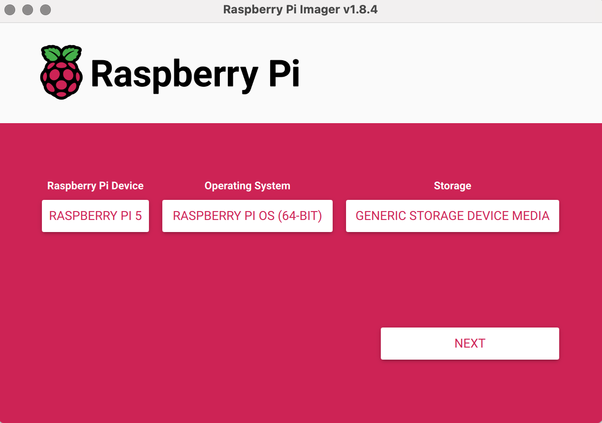

# Setup Instructions with Package

## Prerequisites

### Hardware
- Raspberry Pi 4 or 5 (4GB or 8GB RAM recommended)
  - The following setup instructions are tested with a Raspberry Pi 5. The system has worked completely on a RPi4, too, though. There is at least one setup step necessary for RPi5 that is not necessary for RPi4, which is marked at the step.

### Software

- A Unix-like operating system, preferably Raspberry Pi OS (Debian-based)
  - The setup has been tested on Raspberry Pi OS (64-bit) which is based on Debian Bookworm (12).

## Installation Steps

### 0. Build the Dialogbank Package
- If you have not received a specific Dialogbank package, you can build it yourself.
- Install and run Docker Desktop, if you have not already done so.
- Clone the rpi-voice-assistant repository to your local machine.
- Run the following commands to build the Dialogbank package from within the rpi-voice-assistant directory:
```bash
   docker compose run --rm dev make
```
- The binary Debian package will be written to `dist/dialogbank.deb`.

### 1. Install Raspberry Pi OS 64-bit on the microSD for the RPi
E.g. using the [Raspberry Pi Imager](https://www.raspberrypi.com/software/). The Raspberry Pi Imager allows setting ssh keys and wifi credentials during installation, which is recommended.


### 2. Boot the Raspberry Pi
- Insert the microSD card into the Raspberry Pi and boot it up. 
- Connect the Raspberry Pi to the internet via Ethernet or WiFi. 
- You can either perform the setup steps from the Raspberry Pi OS Desktop (via connecting a USB mouse and keyboard and a monitor to the RPi) or via SSH. 
- To connect via SSH, you need to know the IP address of the Raspberry Pi. You can find it out by logging into your router and looking for the connected devices or by hovering over the network icon in the Raspberry Pi OS Desktop.Your Raspberry Pi should be connected to the same network as the device you are using to SSH into it.

### 3. Install the Dialogbench Package
- Open a terminal on the Raspberry Pi or SSH into it.
- Copy the dialogbench package (e.g. called: `dialogbank.deb`) to the Raspberry Pi. You can use a USB stick or SCP to copy the file to the Raspberry Pi.
  - If you are using SCP, you can run the following command on your local machine:
  ```bash 
    scp path/to/dialogbank.deb dialogbank@<IP_ADDRESS>:~/dialogbank.deb
  ```
- Run the following commands to install the Dialogbench package (we are assuming it is called `dialogbank.deb`, if it is called differently you need to adapt the commands at those places):
    ```bash
    sudo apt-get update
    sudo apt-get install ./dialogbank.deb
    ```

### 4. Configure the Dialogbench Application
- The configuration file for the Dialogbank application is located at `/etc/dialogbank/dialogbank.env`.
- Fill in the `VF_API_KEY`, `EL_API_KEY` and `EL_VOICE_ID` with the respective API keys for Voiceflow and Elevenlabs and a voice ID from Elevenlabs.
- You can e.g. use the `nano` text editor to edit the file:
  ```bash
  sudo nano /etc/dialogbank/dialogbank.env
  ```
- Add the `google-application-credentials.json` to the Dialogbank configuration directory. You can again use scp or a USB drive to accomplish this. For SCP you first need to copy the .json file to a user-owned directory with SCP and then use `sudo` to copy it to the Dialogbank configuration directory. You will also need to adapt the file reading permissions to allow the dialogbank service to access the google credentials file.
  ```bash
  scp path/to/google-application-credentials.json dialogbank@<IP_ADDRESS>:
  sudo cp ~/google-application-credentials.json /etc/dialogbank/
  sudo chmod o+r /etc/dialogbank/google-application-credentials.json
  ```

### 5. Restart the RPi
- After you have configured the Dialogbank application, restart the Raspberry Pi to apply the changes:
  ```bash
  sudo reboot now
  ```
- After the Raspberry Pi has rebooted, you should see a terminal opened with the Dialogbank application running and LEDs lighting up on the LED strip. (Two green LEDs should light up on the left of the strip, indicating connected WiFi and a running Dialogbank application.)
  

### 6. Test the Dialogbank Functionality
- Connect Headphones (via an audio adapter that allows audio input and output) or an USB-telephone receiver and a keyboard.
- If you connected a telephone receiver via USB: You need to configure the audio output to be streamed by the telephone receiver. For this, right click on the speaker symbol in the right upper task bar in the RPi Desktop UI and select "USB Audiodevice". Adapt volume to fit your use case via left click on speaker symbol.
- Test starting with "s" and do a complete run through the dialogue.
- Test starting with "s" and interrupting with "q". The dialogue should be interrupted and the application should return to the start state. Test restarting the dialogue with "s" again.

### 7. Setup Tailscale
Optional: Setup Tailscale for remote access to the Raspberry Pi. This is useful if you want to access the Raspberry Pi from outside your local network or allow devs access to the Raspberry Pi for debugging purposes.
- Prerequisites: You need to have a Tailscale account and have the Tailscale client installed on your local machine from which you want to remotely access the RPi. You can download the Tailscale client from the [Tailscale website](https://tailscale.com/download).

To install Tailscale on the Raspberry Pi:
- Open a terminal on the Desktop or via SSH.
- Run the following command:
  ```bash
  sh /usr/share/python/lib/python3.11/site-packages/dialogbank/setup_tailscale.sh
  ```
- The script runs all relevant installation steps. You will be shown a link to authenticate the Raspberry Pi with your Tailscale account as in the screenshot. Follow the link (you can copy it and use the link on your laptop/device that you use to access the RPi) and authenticate the Raspberry Pi. 
  - 
- After that, the Raspberry Pi should be connected to your Tailscale network and the script should end with a 'Success' message.
  - 
- Adjust the `devicename` of the registered RPi in the Admin Dashboard if relevant.
- We use an ACL rule set that allows only connections from devices with tag `personal_device` to devices with tag `rpi`. In case that you are using ACL rules, set the tag `rpi` for the registered RPi in tailnet Admin dashboard.


